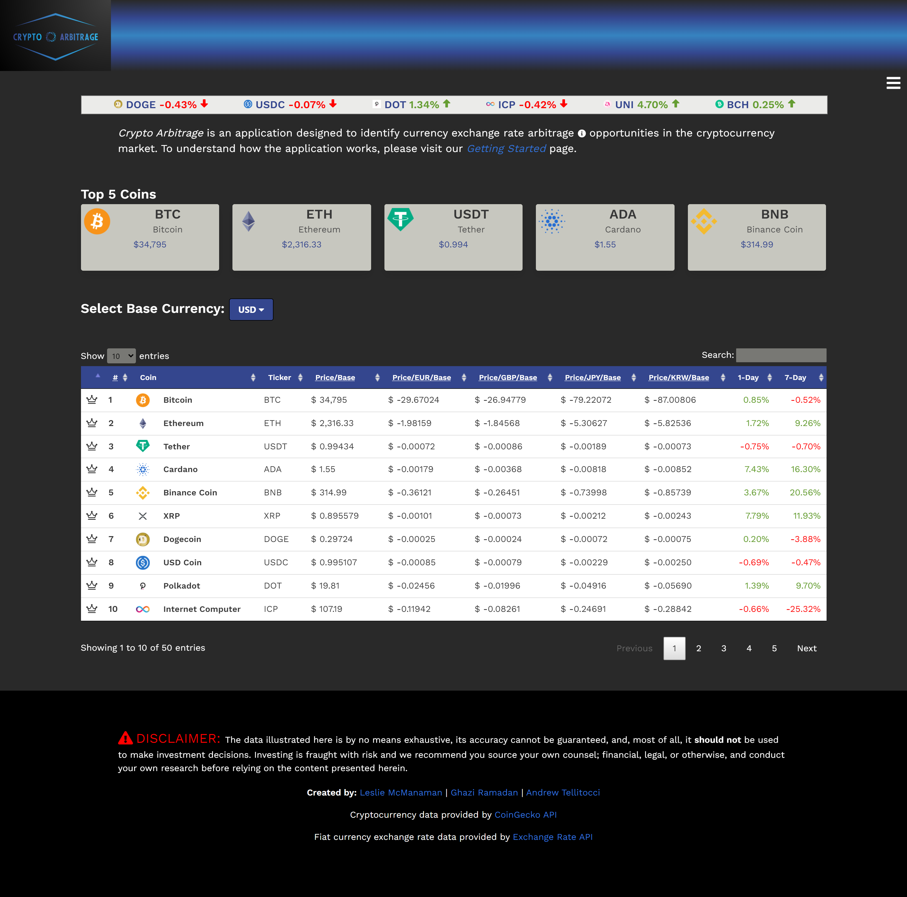
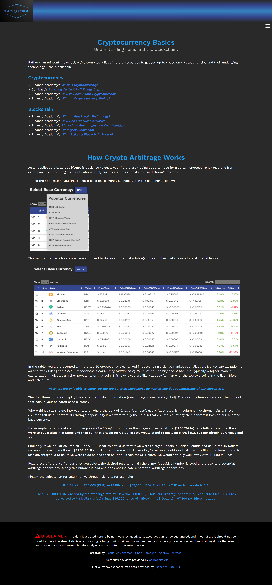

# Crypto Arbitrage
Butler Boot Camp Project 1 Group 1

## Built With
 
 
 
 

## Frameworks
* [Bulma](https://bulma.io/)
* [Bulma Toast Plug-in](https://rfoel.github.io/bulma-toast/#doc)
* [DataTables JQuery Plug-in](https://datatables.net/)
* [FontAwesome](https://fontawesome.com/)
* [CoinGecko Cryptocurrency API](https://www.coingecko.com/en/api)
* [Exchange Rate API](https://www.exchangerate-api.com/)

## Crypto Atribitrage
* Crypto Arbitrage is a tool designed to explore mispriced coins due to discrepancies in exchange rates of national currencies (fiat currencies).
* A potential user would be a crypto investor who would like to explore non-traditional opportunitites for making profits in the market. Our site will show the top 50 cryptocurrency coins and compare their prices in various fiat currencies to find possible mis-priced assets. If a mis-priced asset is found, an investor could then profit from it. 

## Preview Photos

### Main Page

### Education Page

## Links to Project
* Website [https://antellitocci.github.io/crypto-arbitrage/](https://antellitocci.github.io/crypto-arbitrage/)
* GitHub Repositiory available [here](https://github.com/antellitocci/crypto-arbitrage)

## Links to Github Portfolio Pages
* [Leslie](https://github.com/lmcmanaman/Portfolio)
* [Ghazie](https://github.com/ghazie754)
* [Andrew](https://github.com/antellitocci/portfolio)

## Resources
* Table pre-loader icon: [icons8.com](https://icons8.com/preloaders/en/filtered-search/cryptocurrency_and_money/free/#)
* Ticker CSS [Lewis Carey](https://codepen.io/lewismcarey/pen/GJZVoG)
* Nested API Calls: [Go Make Things](https://gomakethings.com/how-to-use-the-fetch-method-to-make-multiple-api-calls-with-vanilla-javascript/)

## Created By
* Leslie McManaman
* Ghazi Ramadan
* Andrew Tellitocci
